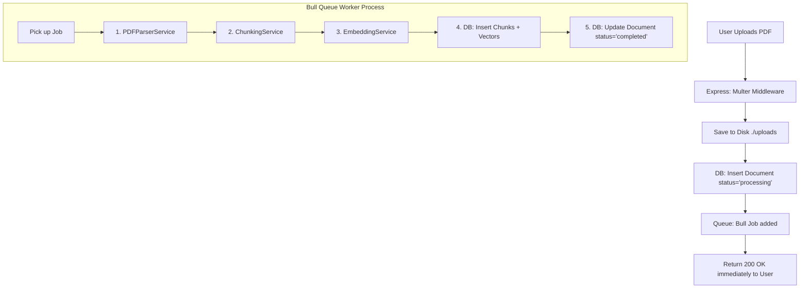
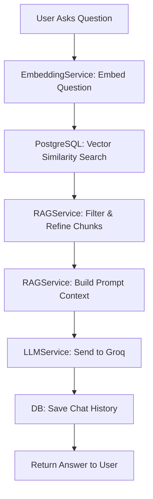

# 🧠 System Architecture Deep Dive
*The Comprehensive Guide to the Inner Workings of the AI RAG Engine*

This document serves as the ultimate deep-dive into the AI Retrieval-Augmented Generation (RAG) system. It explains the **minute technical details** of every service, how algorithms like chunking and similarity comparison actually work under the hood, and how data flows through the application.

If you want to understand *exactly* how this system works, read this document.

---

## 1. 🏗️ High-Level 8-Layer Architecture

Before diving into the algorithms, here is the mental model for how the system is structured:
1. **Presentation:** React + Vite + Tailwind CSS (2-column layout).
2. **API Gateway:** Express.js routing HTTP requests.
3. **Controllers:** Thin wrappers orchestrating the flow.
4. **AI Services:** Pure, stateless business logic (`ChunkingService`, `RAGService`, etc.).
5. **Third-Party APIs:** Groq (LLM) and HuggingFace (Embeddings).
6. **Data Storage:** PostgreSQL + `pgvector`.
7. **Cache & Queue:** Redis + Bull.
8. **Deployment:** Docker containers.

---

## 2. 🌊 Flow 1: The File Upload & Processing Pipeline (Async)

When a user uploads a PDF, the processing is entirely **asynchronous and non-blocking**.

### Deep Dive: PDF Parser Service
*   **What it does:** Converts binary PDF buffers into raw text strings.
*   **How it works:** Uses `pdf-parse`. It extracts raw text while stripping out unreadable binary formatting. It has robust error handling—if the Buffer is invalid, it throws a localized `ServiceError` which gracefully fails the background job without crashing the server.

### Deep Dive: The Chunking Algorithm
*   **What it does:** Splits massive documents into smaller, digestible pieces of text ("chunks") that the AI can understand.
*   **How it works (Sliding Window):**
    *   **Base Target:** ~500 characters per chunk.
    *   **Overlap:** 100 characters of overlap between chunks. This prevents cutting a critical sentence or thought in half.
    *   **Boundary Awareness:** It doesn't just cut blindly at 500 characters. It uses Regex (`/[.!?]+/`) to detect **sentence boundaries**. It packs whole sentences into a chunk until it reaches the limit.
    *   **Dynamic Sizing:** If a document is under 5,000 characters, it dynamically shrinks the chunk size to 400 characters to provide better granularity. If the document is massive (>200,000 chars), it increases chunk size to 700 chars to reduce database rows.

### Deep Dive: Vector Embedding Service
*   **What it does:** Converts human text (a chunk) into a mathematical array of numbers (a vector) so the computer can calculate "similarity".
*   **How it works:** 
    *   Uses the official `@huggingface/inference` SDK.
    *   **Model:** `sentence-transformers/all-MiniLM-L6-v2`.
    *   **Dimensions:** It outputs exactly **384 dimensions**. Every chunk of text becomes an array of 384 floating-point numbers.
    *   **Batching:** To avoid hitting rate limits or timing out, it processes chunks in batches of 32 at a time.

### Deep Dive: Caching (Redis)
*   **What it does:** Prevents the system from recalculating embeddings or database hits for identical operations.
*   **How it works:**
    *   The `CacheService` hashes the input text using `SHA-256` to create a unique key (e.g., `cache:embedding:a1b2c3d4...`).
    *   It checks Redis. If it's a cache hit, it returns the 384-dimensional vector instantly (0ms).
    *   **Graceful Degradation:** If Redis crashes, the system does *not* fail. It catches the connection error, logs a warning, and falls back to calculating the embedding fresh (Fail-Open design).

---

## 3. 🌊 Flow 2: The Question & Answer Flow (Sync)

When a user asks a question, the system must retrieve the right information and generate an answer in milliseconds.

### Deep Dive: Vector Similarity Comparison (`pgvector`)
*   **What it does:** Finds the document chunks that most closely answer the user's question.
*   **How it works:**
    *   The user's question is passed to HuggingFace to get a 384-dimensional vector.
    *   We run a SQL query against PostgreSQL using the `<=>` operator (Cosine Distance). 
    *   PostgreSQL uses an **IVFFLAT** (Inverted File with Flat Compression) index to rapidly scan hundreds of thousands of vectors and return the top 30 closest matches in milliseconds.

### Deep Dive: "Perfect RAG" Refinement Logic
Once PostgreSQL returns the top 30 chunks, the `RAGService` applies strict business logic to ensure the LLM isn't confused by "garbage" data.
1.  **Hard Thresholding:** Any chunk with a similarity score below the minimum threshold (e.g., `0.3`) is instantly discarded.
2.  **The "Elbow" Gap Detection:** If Chunk #1 has a similarity of `0.8` and Chunk #2 drops to `0.4`, the system detects a "Relevance Gap". It assumes everything after Chunk #1 is noise and cuts off the list.
3.  **Context Budgeting:** The LLM has a token limit. The system estimates the character count of the refined chunks. If adding the next chunk would exceed the maximum budget (e.g., 12,000 characters), it stops adding chunks.

### Deep Dive: LLM Generation Service
*   **What it does:** Reads the refined chunks and generates a human-like response.
*   **How it works:**
    *   The `RAGService` formats the chunks into a strict prompt: `[Chunk 1]: <text> \n [Chunk 2]: <text>`.
    *   The `LLMService` is stateless. It passes the System Prompt (instructions) and the User Prompt (Context + Question) to the **Groq API**.
    *   Because Groq runs on highly optimized LPUs (Language Processing Units), it streams the generated tokens back at blazing fast speeds.
    *   Cost calculation is done automatically by counting `prompt_tokens` and `completion_tokens`.

---

## 4. 🔗 How It All Connects (The Pipeline Pattern)

To avoid "Service Spaghetti" (where services call each other in an infinite loop), we use **Pipelines**.

For example, the `ChatPipeline`:
1.  Is called by the Controller.
2.  Calls the `EmbeddingService` to embed the question.
3.  Calls the `ChunkRepository` to fetch similar vectors from the DB.
4.  Calls the `RAGService` to refine the vectors.
5.  Calls the `LLMService` to generate the text.
6.  Calls the `ChatRepository` to save the history.

The Services never talk to each other directly. They are completely isolated, making them 100% unit-testable.

## Summary
You now possess a complete understanding of how text is mathematically split, embedded, stored, compared via cosine distance, refined via elbow logic, and generated via LPUs. This is a true Enterprise-grade AI architecture!
