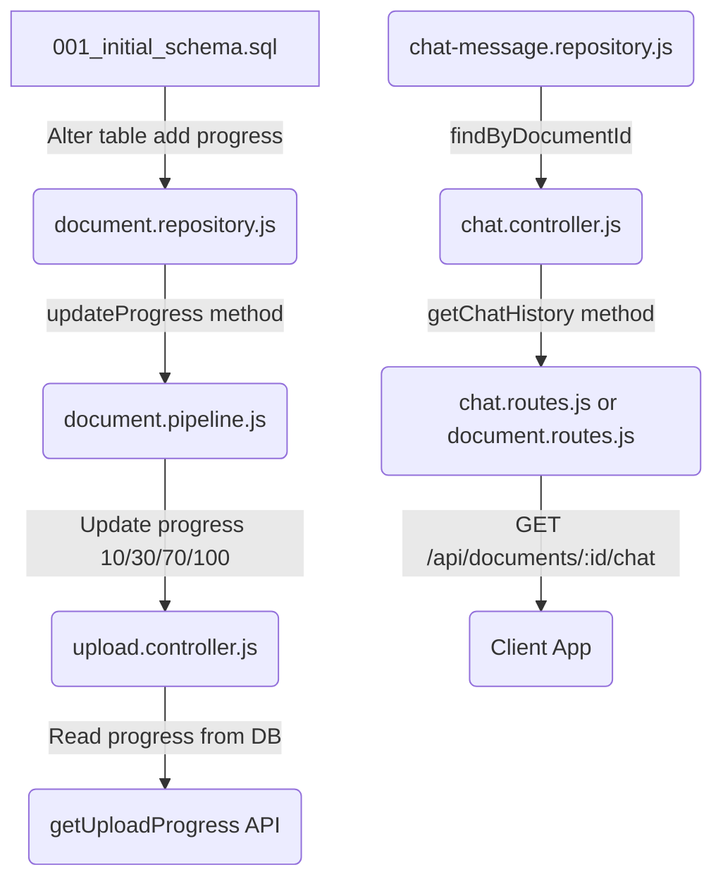

# 📑 Implementation Plan: Backend Gap Resolution

This document outlines the step-by-step strategy for resolving outstanding backend gaps in the `ai-rag-pdf-chat` repository. These changes comply with the decoupled 5-layer clean architecture defined in `CODING_GUIDELINES.md`.

---

## 🎯 Gaps To Resolve

1. **Missing Chat History Endpoint (`GET /api/documents/:id/chat`)**
   - **Problem:** Chat messages are saved to the database but cannot be retrieved by the frontend.
   - **Solution:** Expose a REST endpoint that queries past chats using the repository layer.
2. **Static Upload Progress Reporting**
   - **Problem:** The progress API endpoint returns a hardcoded `50%` when a document is processing.
   - **Solution:** Add a `progress` integer column to the `documents` table and update it dynamically in the pipeline.
3. **Database Migration Safety**
   - **Problem:** Existing database containers do not have the `progress` column.
   - **Solution:** Add an idempotent schema migration clause to alter the table if the column is missing.

---

## 🏗️ Detailed Action Steps



### Step 1: Database Migration
* **Target File:** `backend/src/db/migrations/001_initial_schema.sql`
* **Changes:**
  1. Add `progress INTEGER DEFAULT 0` directly into the `CREATE TABLE IF NOT EXISTS documents` declaration.
  2. Add an idempotent alter statement to ensure existing DB containers are modified upon startup:
     ```sql
     ALTER TABLE documents ADD COLUMN IF NOT EXISTS progress INTEGER DEFAULT 0;
     ```

---

### Step 2: Update Repository Layers
* **Target File:** `backend/src/repositories/document.repository.js`
* **Changes:**
  1. Update the `findAll` and `findById` select queries to select the `progress` column.
  2. Implement an idempotent update method:
     ```javascript
     async updateProgress(id, progress) {
       await pool.query(
         `UPDATE documents SET progress = $1, updated_at = CURRENT_TIMESTAMP WHERE id = $2`,
         [progress, id]
       );
     }
     ```

---

### Step 3: Update Document pipeline
* **Target File:** `backend/src/pipelines/document.pipeline.js`
* **Changes:**
  1. In `process(documentId, filePath, onProgress)`:
     - Replace raw `onProgress(x)` callbacks with database progress update calls:
       `await documentRepository.updateProgress(documentId, x);`
       followed by `onProgress(x);` to retain Bull queue reporting compatibility.
     - Call this during start (0%), extraction (30%), chunking (50%), embedding (70%), storing (90%), and completion (100%).
     - Set progress to `0` or `100` on failures/completions.

---

### Step 4: Update Progress Controller
* **Target File:** `backend/src/controllers/upload.controller.js`
* **Changes:**
  1. Update `getUploadProgress` to read the progress directly from the document record fetched from the database:
     ```javascript
     progress: document.progress
     ```

---

### Step 5: Implement Chat History Route & Controller
* **Target File:** `backend/src/controllers/chat.controller.js` or `backend/src/controllers/document.controller.js`
* **Decision:** We will place it in `document.controller.js` and map it to `GET /api/documents/:id/chat` because the chat log is resource-centric to a document.
* **Changes:**
  1. Expose `getChatHistory` method:
     ```javascript
     const getChatHistory = async (req, res) => {
       const { id } = req.params;
       // Verify document exists and fetch chat log
       await documentPipeline.get(id); // Will throw NotFoundError if missing
       const { chatMessageRepository } = require('../registry');
       const history = await chatMessageRepository.findByDocumentId(id);
       
       return ApiResponse.success(res, { history });
     };
     ```
  2. In `backend/src/routes/document.routes.js`, register:
     ```javascript
     // GET /api/documents/:id/chat — get document chat logs history
     router.get('/:id/chat', getChatHistory);
     ```

---

## 🧪 Verification Plan

### 1. Automated Tests
We will add new tests to:
* `backend/src/services/llm.service.test.js` or separate integration tests to assert chat history query logic.
* Verify progress tracking updates in the pipeline test suite.

### 2. Manual Test Commands
* **Test Database Migration:** Start the server and verify the column exists:
  ```bash
  docker exec -it rag_chat_postgres psql -U dev -d rag_chat -c "\d documents"
  ```
* **Test Chat History Retrieval:**
  ```bash
  curl http://localhost:5000/api/documents/1/chat
  ```
* **Test Dynamic Progress endpoint:**
  ```bash
  curl http://localhost:5000/api/upload/1/progress
  ```
